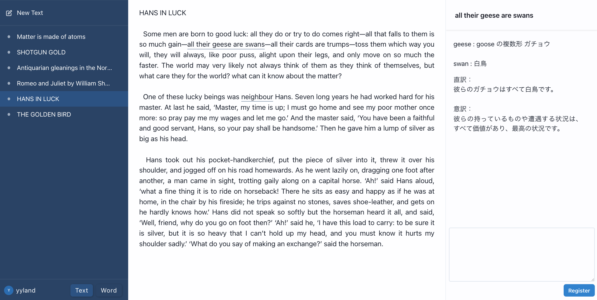

# 英文メモ

### アプリのURL

[www.eibunmemo.com](https://www.eibunmemo.com)

### メインイメージ

 

## 開発の経緯

社会人を経て大学受験をする際、受験勉強をiPadで完結させられないかと様々なメモアプリを試し、気に入るアプリが1つ見つかりました。  
受験はそのアプリで終えることができたのですが、残念ながら開発中止になり、使えなくなってしまいました。  
長い時間メモアプリを使っていく中で、理想のメモアプリの構想が膨らんでいたので、同じような理想を持っている人もいるはずだと思い、自身で開発して公開したいと思いました。  
理想の形に至るまでの第一ステップとして、英文での学習に特化したアプリを作成しました。

 

## 既存メモアプリの課題解決

### 対象

- 高校生  
- 学校配布端末での使用を想定

### 課題

- 多機能すぎて機能の習得に時間がかかる。
- 不要な情報（使わない機能のメニューやアイコン）が多く画面に表示されている。
- 綺麗なメモを作ろうとしてしまい、そこに時間をかけてしまう。

### 解決

- すぐ使いこなせるように機能をシンプルにする。
- 視覚情報を必要な機能に限定することで、学習に集中できるデザインにする。

 

## 機能一覧

| トップ画面 | メイン画面 |
| ---------- | ---------- |
||  |
| ユーザー登録またはログインを行います。（開いてすぐにメモでき、ログイン時に引き継ぐ機能の追加を予定しております。） | 左：登録済みテキストをリスト表示します。   中央：テキスト内容を表示します。メモした文字に下線が引いてあります。   右：メモ内容を表示します。 |

| テキストの登録 | 文字の選択とメモの登録 |
| ---------- | ---------- |
||  |
| コピーしたテキストを貼り付けて登録します。 | 文字は1文字単位で選択でき、選択中の文字は右上に表示されます。その下のテキストエリアで、文字に紐づいたメモを登録することができます。 |

| 登録済みワードリスト | メモの編集 |
| ---------- | ---------- |
||  |
| テキストのリスト表示から、登録したワードのリスト表示に切り替えることができます。選択中のワードは文中で背景色が付きます。 | メモの編集や削除ができます。もちろん、テキストやワードの削除もできます。 |

 

## ER 図

 

## インフラ構成図

 

## ⚪︎ 主な使用技術

| Category       | Technology Stack                                     |
| -------------- | ---------------------------------------------------- |
| Frontend       | React(18.2.0), Chakra UI(2.7.1)                      |
| Backend        | Ruby(3.1.4), Ruby on Rails(7.0.6)                    |
| Infrastructure | Amazon Web Services                                  |
| Database       | MySQL(8.0.33)                                        |
| Environment    | Docker(20.10.24)                                     |
| CI/CD          | GitHub Actions                                       |
| Monitoring     | Sentry, Route53                                      |
| Design         | PlantUML, draw.io(diagrams.net)                      |
| etc.           | ESLint, RuboCop, RSpec, Git, GitHub                  |

 

## 今後の展望

英語学習アプリとしては
- 処理速度向上
- PDFの読み込み
- より自由なメモの書き込み
- 単語暗記機能の強化  

など、本格使用に対応した機能開発を続けていきます。  
続けて、全科目対応もしていきたいです。  特に、縦書きに十分に対応したアプリは見つからなかったので、英語の次は国語の対応を考えています。