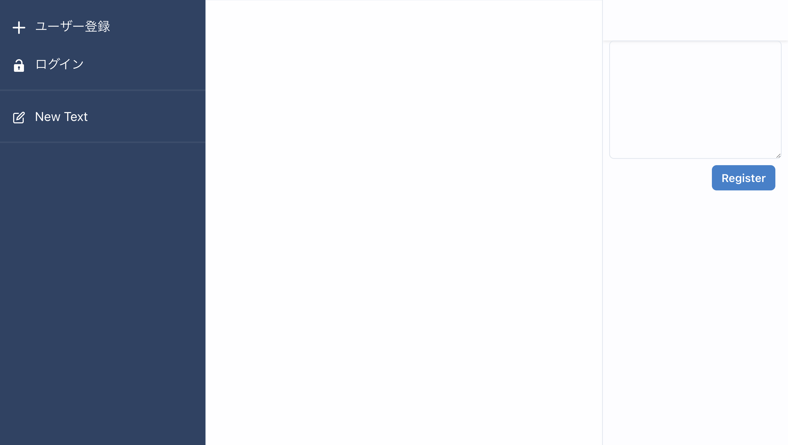
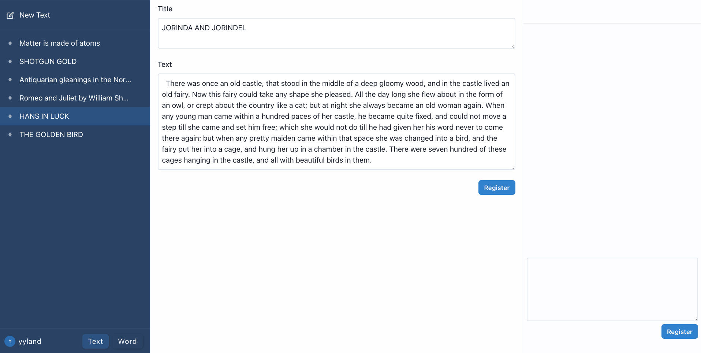
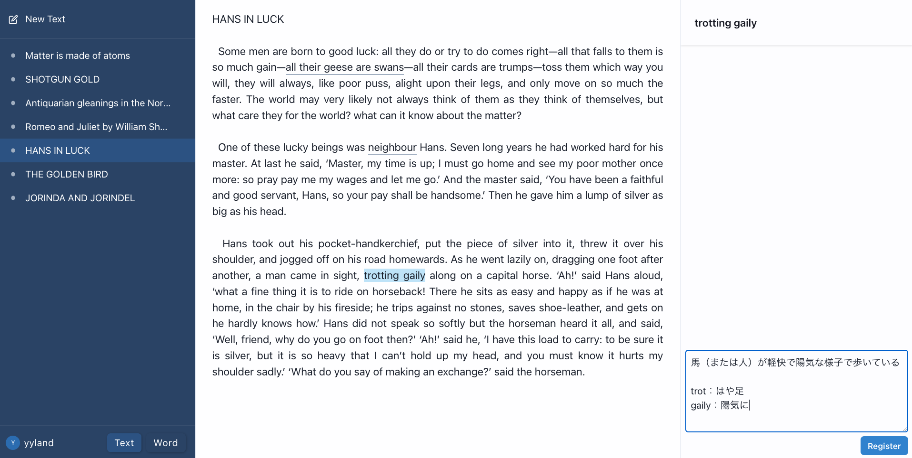
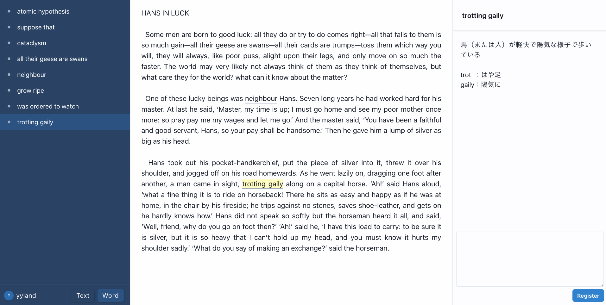
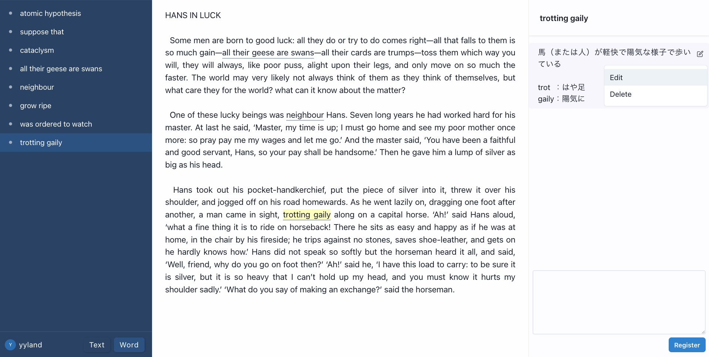

# 英文メモ

### アプリのURL

[www.eibunmemo.com](https://www.eibunmemo.com)

 

## 開発の経緯

社会人を経て大学受験をする際、受験勉強をiPadで完結させられないかと様々なメモアプリを試し、気に入るアプリが1つ見つかりました。  
受験はそのアプリで終えることができたのですが、残念ながら開発中止になり、使えなくなってしまいました。  
長い時間メモアプリを使っていく中で、理想のメモアプリの構想が膨らんでいたので、同じような理想を持っている人や、その実現が学習への意欲に繋がる人もいるはずだと思い、自身で開発して公開したいと思いました。  
理想の形に至るまでの第一ステップとして、英文での学習に特化したアプリを作成しました。

 

## 既存メモアプリの課題解決

### 対象

- 高校生  
- 学校配布端末での使用を想定

### 課題

- 多機能すぎて機能の習得に時間がかかる。
- 不要な情報（使わない機能のメニューやアイコン）が多く画面に表示されている。
- 綺麗なメモを作ろうとしてしまい、そこに時間をかけてしまう。

### 解決

- すぐ使いこなせるように機能をシンプルにする。
- 視覚情報を必要な機能に限定することで、学習に集中できるデザインにする。

 

## 工夫したこと

- **ゲストユーザー機能**    

  ログインなしで全ての機能が使えます。  
  ゲストとして追加したテキストやメモは、ログインすると自動で引き継がれます。  
  パスワードはなんだっけと調べていたり、再発行しているうちに、メモしようとしていた内容を忘れてしまったり、クリップボードのテキストを誤って消してしまうかもしれません。  
  そうしたことを防ぐため、「とりあえずメモ」することができるようにしました。

- **複数単語の選択に対応**  

  1文字単位でメモするワードを選択できます。  
  単語だけでなく、熟語の意味や、センテンスの訳などもメモすることができます。  

- **選択したワードは位置も記録**  
  
  たとえば「them」を選択して、「ここのthemは前文のstudentsではなく、recent changesを指している」ことをメモするとします。ここで位置も記録しておかないと、文中のthem全てにこのメモが紐づけられて、メモの内容にそぐわなくなってしまいます。そのため、特定のthemにメモできるような仕組みにしました。  

  _仕組み_
  1. 検出した選択開始位置と終了位置を記録する
  2. 選択ワードを記録する
  3. 検出位置がずれることもあるため、検出位置と選択ワードの組み合わせから、実際の選択位置を割り出す
  
- **表示される情報は必要なものに限定して見やすくする**  
  
  学校配布のコンピュータ端末は画面が小さめなことが多いため、細かい情報の表示をなくし、必要な情報を広くとって見やすくなるよう配慮しました。特に横長の画面がほとんどであることから、縦方向に英文表示領域が狭くならないよう意識しました。

 

## 機能一覧

| トップ画面 | メイン画面 |
| ---------- | ---------- |
||  |
| ゲストユーザーとして自動ログインされます。正規ユーザーへの登録やログインをした際は、新規で登録したテキストはゲストユーザーから引き継がれます。急ぎのメモをサイトを開いてすぐ取ることができます。 | 左：登録済みテキストをリスト表示します。   中央：テキスト内容を表示します。メモした文字に下線が引いてあります。   右：メモ内容を表示します。 |

| テキストの登録 | 文字の選択とメモの登録 |
| ---------- | ---------- |
||  |
| コピーしたテキストを貼り付けて登録します。 | ワードは1文字単位で選択でき、選択中のワードは右上に表示されます。その下のテキストエリアで、ワードに紐づいたメモを登録することができます。 |

| 登録済みワードリスト | メモの編集 |
| ---------- | ---------- |
||  |
| テキストのリスト表示から、登録したワードのリスト表示に切り替えることができます。選択中のワードは文中で背景色が付きます。 | メモの編集や削除ができます。もちろんテキストやワードの削除もできます。 |

 

## ER 図

 

## インフラ構成図

 

## ⚪︎ 主な使用技術

| Category       | Technology Stack                                     |
| -------------- | ---------------------------------------------------- |
| Frontend       | React(18.2.0), Chakra UI(2.7.1)                      |
| Backend        | Ruby(3.1.4), Ruby on Rails(7.0.6)                    |
| Infrastructure | Amazon Web Services                                  |
| Database       | MySQL(8.0.33)                                        |
| Environment    | Docker(20.10.24)                                     |
| CI/CD          | GitHub Actions                                       |
| Monitoring     | Sentry, Route53                                      |
| Design         | PlantUML, draw.io(diagrams.net)                      |
| etc.           | ESLint, RuboCop, RSpec, Git, GitHub                  |

 

## 今後の展望

- 処理速度を向上し、端末スペックが低めでもきびきびした動作にする  
  
  _要改善点_
  - 登録したワードの位置特定処理  
  - 初回アクセス時の読み込み処理

- PDFの読み込みに対応する  

  PDF形式で購入した書籍や、自身でスキャンしてPDF化した文書をそのまま読み込めるようにしたいです。  
  実際、学校でPDF形式で教科書を購入する場合があるので、必須機能です。

- より自由なメモの書き込みを可能にする  

  - メモに至るステップを短縮  
    登録や編集のボタンをなくし、メモ欄に直接記入できるようにする。  
    Apple Pencilに対応し、筆記のメモができるようにする。  
  
  - 登録ワードの関連付け  
    文中の離れた位置で関連しているワードについて、「ここではこういう意味だが、ここではこういう意味になる」というメモができるようにする。  

  - 句動詞に対応する  
    「turn it on」を 「turn ... on」 として登録して、文中で表示する下線を実線と点線で分ける。  

    _方法_  
    一度turn it onを選択し、選択ワード（右上に表示）上でitを選択することで、点線箇所と判定する。  

    登録までにひと手間かかりますが、メモでの説明を省けることと、文中でより意味のある下線を引けることから、メリットのある機能だと思います。

- ワード暗記機能の強化  
  
  - ワードリスト表示モードのとき、テキストとメモはヒントや答えとして位置づけ、表示非表示を選べるようにする。
  - 覚えたワードはリストから非表示にできる。  
  - テキスト上の登録ワード箇所を穴あきにして、クリックすると表示されるようにする。

など、複雑な操作にならないよう留意しつつ、より学習効果を高める機能の開発を続けていきます。  

続けて、全科目対応もしていきたいです。  特に、縦書きに十分に対応したアプリは見つからなかったので、英語の次は国語の対応を考えています。