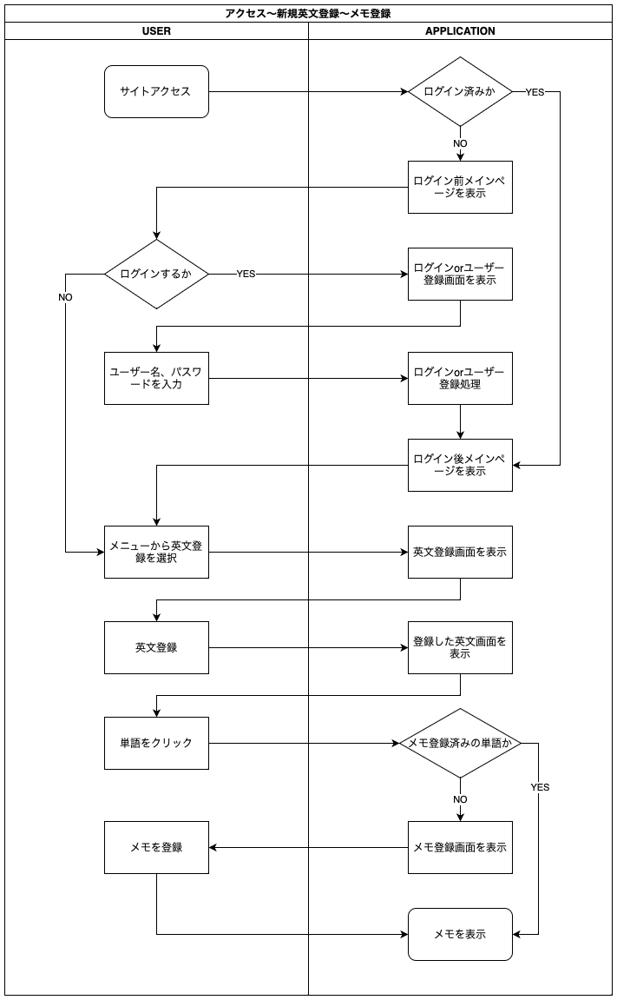
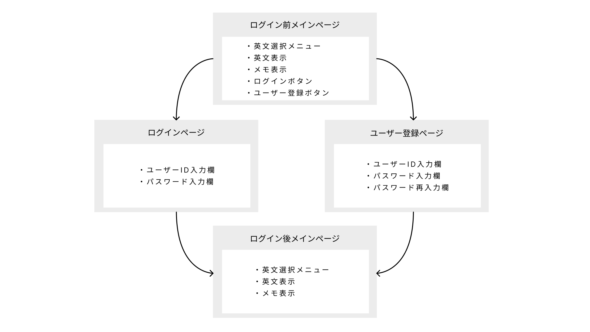
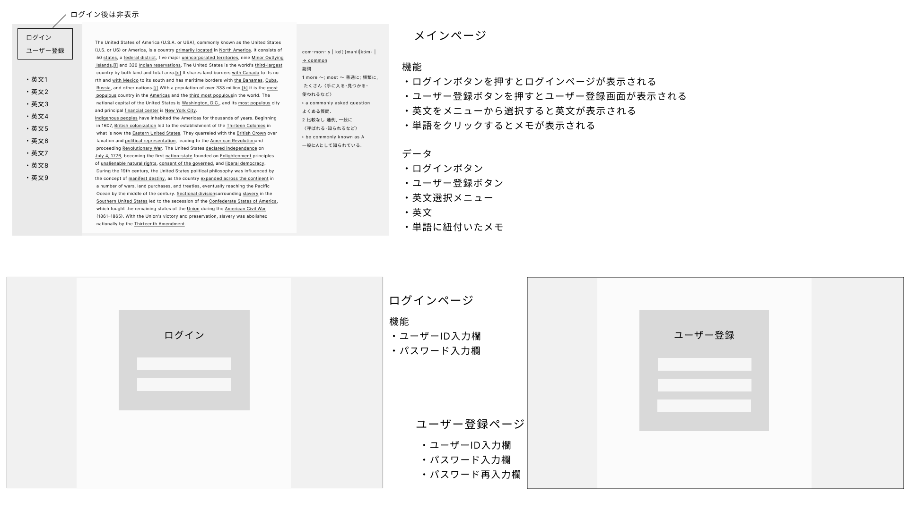

テーマと要件定義

 

## オリジナルプロダクトのテーマ

### 英語長文学習アプリ

軽快な動作とわかりやすい操作感で英語学習に集中できる。

### 対象

- 高校生、英語学習者

#### ユーザー想定

高校3年生 Aさん
 
英語長文の勉強は、まず書籍の白文を2枚コピーし、それをノートに貼っています。
1枚は書き込み用、もう1枚は音読用に白文のままにしています。
出てきた単語は別ページにまとめ、暗記に利用しています。

書き込みは余白にしていますが足らないことも多く、特に書き込みたい箇所が密集していると見辛くなるか、書く量を減らさないといけません。

対応：
- 白文のみの表示にすぐ切り替えられるようにすることで、書き込み用と別で用意する必要をなくす。
- 書き込みを簡単に切り替えられるようにすることで、書き込みたい箇所（単語）が近くても、それぞれの書き込みが別の書き込みに影響が出ないようにする。

単語は単語帳で見るよりも、長文の中で実際に使われているのを見る方が記憶に残りやすいと感じるので、単語のリストと長文との行き来がしやすいほうがいいです。
しかしその場合、隙間時間に単語暗記をしたくても大きな長文用ノートを取り出すしかありません。しかもコピーを貼っているのでとても分厚くゴワゴワしており、気軽に取り出して単語の勉強をするには向いていません。また、単語帳と違い単語から逆引きができないのも不便です。単語がどの長文で出てきたものかは、頑張って探すしかありません。自分で索引を作ればできますが…大変です。

対応：
- メモした単語のリストを自動で作成し、単語から長文へもアクセスできるようにする。
- 単語リストは長文ごとにも分けられるようにする。
- 単語の検索もできるようにする。
- 手軽に単語の学習をしたいときはスマホでできるようにする。　　

### 既存アプリの課題

文書・メモアプリ
- Google Document
- One Note
- EverNote
- Notion

学生が学習するうえで、既存の文書アプリのデメリットとして、
多機能すぎるという問題があります。

#### 多機能であるデメリット
- 使い始められるまでに時間がかかる
- 最低限以上に「機能の」学習に時間を割いてしまう
- メニューが画面を占める割合が大きく、学習に必要なスペースが小さくなる
- 不要なメニューにより視覚的に気が散る
- 綺麗なメモを作ろうとしてしまい、そこに時間をかけてしまう
- アプリによっては使っていくうちに動作が重くなっていく（という評判がある）

#### 最低限必要な機能
- 英文の登録、選択
- 英文の表示
- メモする単語の指定、メモ
- メモの表示
- 単語リストの表示

### なぜ解決したいか

現在の学校では一人一台、PCやタブレットが提供されています。  
そのため全員がWebアプリで学習できる環境にあり、Webアプリであれば数多くの人たちにアプローチできます。  
既存の文書・メモアプリでカバーできていないと感じる機能を持ったアプリを開発することで、学習意欲や効果がプラスされる人（自分を含め）を増やしたいです。

### どうやって解決するか

以下を重視して開発します
- すぐ使いこなせる機能のシンプルさ
- 学習に集中できるデザインのシンプルさ
- 動作が軽快
- 綺麗なデザイン

### 機能要件

- IDとパスワードによるログイン
- 英文を登録
- 英文を選択するメニュー
- 単語やセンテンス単位のメモ
- メモした単語の一覧表示
- メニュー、メモの表示非表示の切り替え
- 背景画像の変更（紙の質感を含めたい）
- 暗記などに活用できる機能
- (advanced) メモには画像を添付可能

### 非機能要件

- 低スペックPCやタブレットでも軽快に動作すること
- 特に日中のシステム障害時は早急に復旧できること
- スマホは全機能でなくてもよい（単語と対応したメモだけ等）
- 静的解析ツールを用いてコード品質を保つ
- GitHub Actionsを用いたデプロイ
- 定期的なバックアップ
- 利用者数の増加に対応できる
- エラー通知

業務フロー

 

画面遷移図

 

ワイヤーフレーム

 

ER図

 

インフラ構成図

 

